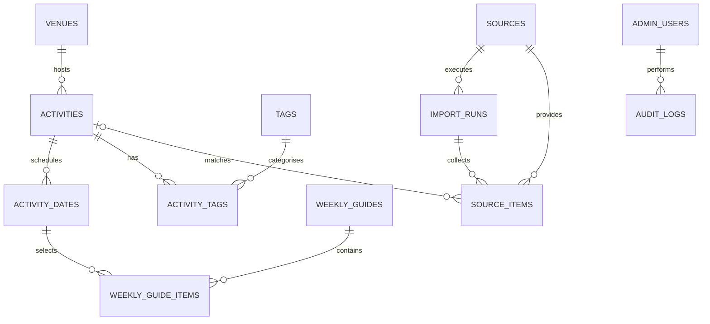

# Database schema

The Tron Loop uses PostgreSQL with TypeORM migrations. Automatic schema
synchronisation is disabled in every environment.

## MVP entity relationships

## Delivery phases

### Activity core

- `activities` stores reusable activity content and publication state.
- `activity_dates` stores one or more scheduled dates for an activity.
- `venues` stores reusable Hamilton venue and location data.
- `tags` stores public activity categories.
- `activity_tags` is the explicit many-to-many join table.

### Weekly guides

- `weekly_guides` stores each editorial week and publication state.
- `weekly_guide_items` selects and orders specific activity dates.

### Ingestion

- `sources` stores approved data-source definitions.
- `import_runs` records each collection attempt and its result.
- `source_items` retains raw source evidence and review state.

### Administration

- `admin_users` stores administrator identities and password hashes.
- `audit_logs` records important administrative actions.

Only the activity-core tables are implemented in the initial migration. Later
tables are added with the feature that uses them.

## Conventions

- Primary keys use UUIDs.
- Database names use `snake_case`; TypeScript properties use `camelCase`.
- Times use PostgreSQL `timestamp with time zone` and are displayed in
  `Pacific/Auckland` unless a date specifies another timezone.
- Foreign-key columns are indexed when an existing composite index does not
  already cover them.
- Destructive relationship cleanup uses explicit `ON DELETE` rules.
- Every schema change is made through a reviewed migration.
